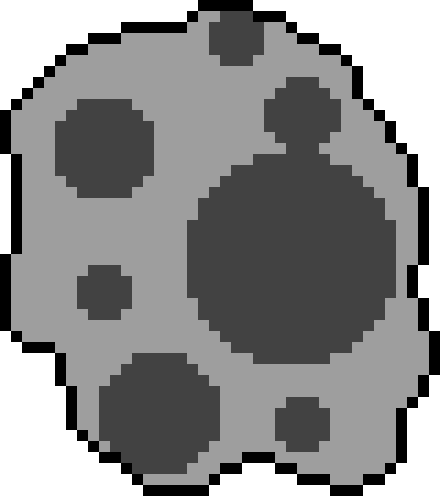

# **PlanetHit - Project**
## **Introduction**
* Phạm Xuân Bách - MSSV: 21020283 - K66CB - UET
* BTL: PlanetHit (INT2215 2 - Lập trình nâng cao)
## **Description**

### *Preview*
- Một số hình ảnh của game:

### *Gameplay*
- Game có **hành tinh** và **tàu vũ trụ** quay xung quanh tâm của màn hình chơi. **Người chơi** cần điều khiển **tàu vũ trụ** và bắn hạ những con **virus** xuất hiện trên **hành tinh** tự quay quanh chính nó.
- **Người chơi** có 5 mạng:heart:. Mất 1 mạng khi va chạm với **thiên thạch** xuất hiện ngẫu nhiên trên màn hình. Hết 5 mạng trò chơi sẽ kết thúc:skull_and_crossbones:.
- Càng về sau, tốc độ tự quay của **hành tinh** và tốc độ sinh ra của **thiên thạch** là ***càng lớn***.
- **Người chơi** chơi đạt được một số điểm cao nhất định sẽ unlock được skin của **tàu vũ trụ, hành tinh và đạn**:rocket:.
### *Main menu*
- **Play**: Vào game thôi!:love_you_gesture:
- **Option**: Nơi người chơi có thể chỉnh skin theo ý muốn.
- **Help**: Hướng dẫn cơ bản cho người mới.
- **Exit**: Thoát game.
### *Controls*
| Control | Key 1 | Key 2 |
|---------|-------|-------|
| UP      | W     | ↑     |
| DOWN    | S     | ↓     |
| LEFT    | A     | ←     |
| RIGHT   | D     | →     |
| MENU    | ESC   |       |
### *Techniques used*
* Thư viện SDL2.0
* Tìm hiểu lập trình hướng đối tượng
* Các cách xử lí va chạm, sự kiện
* Kiểm soát các biến điều khiển game
* Tạo giao diện thân thiện với người dùng
### *Sources*
* https://lazyfoo.net/tutorials/SDL/index.php(các cách xử lí va chạm, sự kiện, ...).
* https://www.youtube.com/watch?v=_yyKYl1LAHM(ý tưởng game).
* Graphics: tự thiết kế 80%, lấy ý tưởng từ các nguồn asset như freepik, pngtree, google images,...
* Sounds: nhặt các file effect nhạc trên Youtube và mạng.
### *Mức điểm tự đánh giá: 9.75/10.*